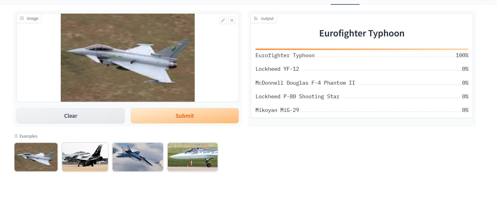

# Fighter-Jet-Image-Recognizer

# Description
The project is all about Military aviation more specifically fighter jet image recoginizer which can identify fighter aircraft from the image of the aircraft provided as input.

# Technical Specification:
1. FastAi for data preprocessing,training etc.
2. Gradio.
3. Hugging face space for deployment.
4. GitHub page for API

# Fighter Jet-Recognizer
An image classification model from data collection, cleaning, model training, deployment and API integration.  
The model can classify 26 different types of Fighter Aircrafts  
The types are following:  
1. General Dynamics F-16 Fighting Falcon aircraft
2. Mikoyan MiG-29
3. Dassault Rafale
4. Lockheed Martin F-22 Raptor
5. Mikoyan Mig-31
6. Sukhoi Su-27
7. Lockheed Martin F-35 Lightning II
8. KAI KF-21 Boramae
9. Sukhoi Su-57
10. Shenyang FC-31 Gyrfalcon
11. Boeing F-15EX Eagle II
12. Eurofighter Typhoon
13. AIDC F-CK-1 Ching-kuo
14. Lockheed YF-12
15. Mikoyan MiG-31
16. McDonnell Douglas F-4 Phantom II
17. Grumman F-14 Tomcat
18. English Electric Lightning
19. Focke-Wulf Fw 190
20. Mikoyan-Gurevich MiG-25
21. Lockheed P-80 Shooting Star
22. Sukhoi Su-34
23. Chengdu J-20
24. Sukhoi Su-35
25. Chengdu J-10
26. Mikoyan MiG-35

# Dataset Preparation
**Data Collection:** Downloaded from DuckDuckGo using term name  
**DataLoader:** Used fastai DataBlock API to set up the DataLoader.  
**Data Augmentation:** fastai provides default data augmentation which operates in GPU.  
Details can be found in `notebooks/data_prep.ipynb`

# Training and Data Cleaning
**Training:** Fine-tuned a resnet34 model for 25 epochs (8 times) and got upto ~84% accuracy.  
**Data Cleaning:** This part took the highest time. Since I collected data from browser, there were many noises. Also, there were images that contained. I cleaned and updated data using fastai ImageClassifierCleaner. I cleaned the data each time after training or finetuning, except for the last time which was the final iteration of the model.  

# Model Deployment
I deployed to model to HuggingFace Spaces Gradio App. The implementation can be found in `deployment` folder or [here](https://huggingface.co/spaces/Shoaib-33/Fighter-jet-Image-Recogniser).  

# API integration with GitHub Pages
The deployed model API is integrated [here](https://shoaib-33.github.io/Fighter-Jet-Image-Recogniser/) in GitHub Pages Website. Implementation and other details can be found in `docs` folder.
